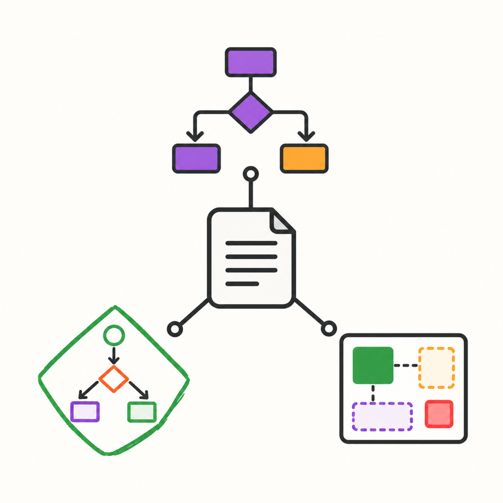
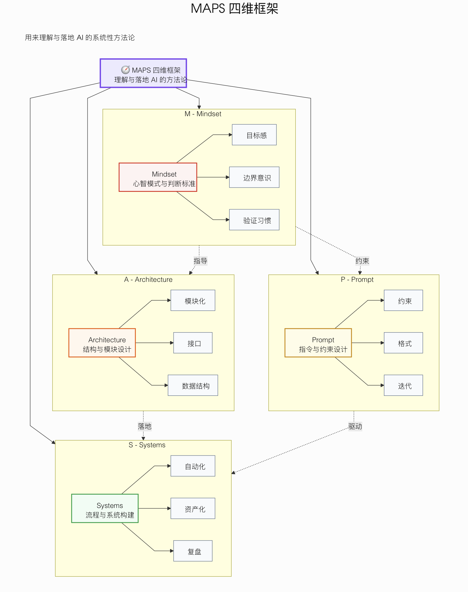
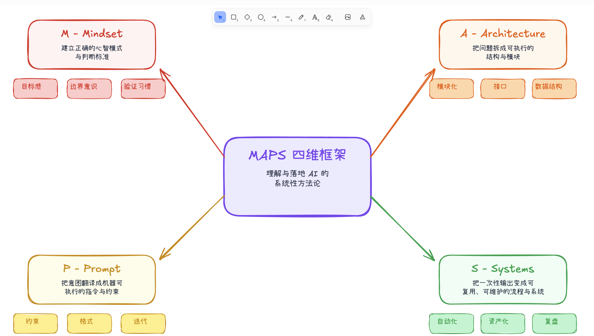
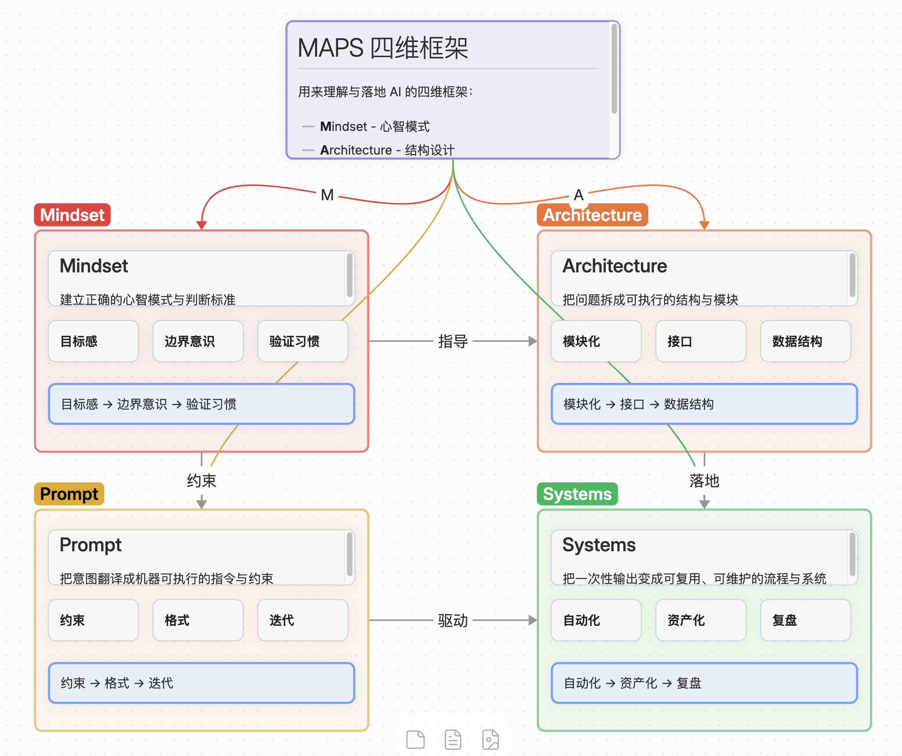

# Obsidian Visual Toolkit

[](LICENSE)
[](skills/)
[](#status)

**[中文文档](README_CN.md)**

Turn notes, outlines, and workflows into Mermaid diagrams, editable Excalidraw drawings, and Obsidian Canvas knowledge maps. The same three skills are packaged for Claude, Claude Code, ChatGPT, and Codex.

Published by Axton Liu. This is an independent community project, not an official Obsidian, Excalidraw, Mermaid, Anthropic, or OpenAI product.



## Included workflows

| Skill | Best for | Output |
|---|---|---|
| `mermaid-visualizer` | Processes, architectures, sequences, states, comparisons | Mermaid code in Markdown |
| `excalidraw-diagram` | Editable hand-drawn diagrams, mind maps, timelines, matrices | `.excalidraw` or Obsidian Excalidraw `.md` |
| `obsidian-canvas-creator` | Spatial knowledge maps and interactive mind maps | Obsidian `.canvas` JSON |

The skills have deliberately narrow trigger boundaries:

- Ask for **Mermaid** when you need portable diagram code.
- Ask for **Excalidraw** when you need a hand-drawn, editable diagram.
- Ask for **Obsidian Canvas** when you need a spatial knowledge map.

## Demo

| Mermaid | Excalidraw | Obsidian Canvas |
|---|---|---|
|  |  |  |

## Status

This project is in beta. The three workflows are usable and packaged for public plugin testing. Output can vary with model version and input complexity, so review generated diagrams before relying on them in production documentation.

## Requirements

Use a host that supports skills or plugins; the host's account and plan requirements apply. The plugin needs no additional account, API key, MCP server, or package installation.

Optional viewers and editors:

- Mermaid-compatible Markdown renderer, such as Obsidian or GitHub
- [Excalidraw](https://excalidraw.com/) for `.excalidraw` files
- [Obsidian Excalidraw plugin](https://github.com/zsviczian/obsidian-excalidraw-plugin) for Obsidian Excalidraw Markdown files
- [Obsidian](https://obsidian.md/) for `.canvas` files

The plugin can return the artifact content directly. When the host provides a writable workspace, it may also save the requested file there.

## Data and execution

The installed skills read the content you supply and return diagram code or files. They do not connect to a server, collect analytics, or automatically upload content to a viewer. User-provided notes may contain personal data; processing and retention in the host follow that host's policies. Saved outputs remain in the workspace you choose. Opening an output in an optional online editor is your choice.

The repository's Python scripts validate and package the plugin for maintainers. They use the Python standard library, read local plugin files, and write ZIP files to `dist/`; they do not run automatically when the skills are used.

## Installation

### Claude: local installation and testing

Clone this repository and build the Claude ZIP with Python 3:

```bash
python3 scripts/package_plugin.py --target claude
```

In Claude, open **Customize → Plugins → Add → Upload plugin**, then select `dist/obsidian-visual-toolkit-claude-0.1.1.zip`. Start a new conversation and ask for one of the three diagram formats.

To test in Claude Code from the repository's parent folder:

```bash
claude --plugin-dir ./obsidian-visual-toolkit-plugin
```

The plugin is not yet listed in the Claude or OpenAI directories. Use the installation methods here until a listing is published.

### OpenAI Plugins Directory

After approval and publication, install **Obsidian Visual Toolkit** from the universal Plugins Directory shared by ChatGPT and Codex.

### Codex repository marketplace testing

Add this repository as a marketplace source:

```bash
codex plugin marketplace add axtonliu/obsidian-visual-toolkit-plugin --ref main
codex plugin add obsidian-visual-toolkit --marketplace obsidian-visual-toolkit-marketplace
```

You can also install it from the ChatGPT desktop app. Test the installed plugin in a new task so the final package is loaded cleanly.

## Example prompts

```text
Turn this deployment workflow into a horizontal Mermaid diagram.

Create a standard Excalidraw architecture diagram from these components.

Organize this article outline as an Obsidian Canvas mind map.

Compare a monolith and microservices architecture as a Mermaid diagram.
```

## Project structure

```text
obsidian-visual-toolkit-plugin/
├── .claude-plugin/
│   └── plugin.json
├── .codex-plugin/
│   └── plugin.json
├── assets/
├── evals/
│   └── submission-tests.json
├── scripts/
│   ├── package_plugin.py
│   └── validate_plugin.py
├── skills/
│   ├── excalidraw-diagram/
│   ├── mermaid-visualizer/
│   └── obsidian-canvas-creator/
├── LICENSE
├── PRIVACY.md
├── SUPPORT.md
└── TERMS.md
```

## Validate and package

```bash
python3 scripts/validate_plugin.py
claude plugin validate .
python3 scripts/package_plugin.py --target claude
python3 scripts/package_plugin.py
```

The package script writes a host-specific ZIP to `dist/` after validation succeeds. Claude directory submissions read the GitHub repository directly; its portal validation and review are separate from these local checks.

## Privacy and support

- [Privacy Policy](PRIVACY.md)
- [Terms of Use](TERMS.md)
- [Support](SUPPORT.md)

## Acknowledgments

This plugin packages and adapts the public skills from [axton-obsidian-visual-skills](https://github.com/axtonliu/axton-obsidian-visual-skills) for Claude and OpenAI plugin formats.

## License

MIT © Axton Liu
